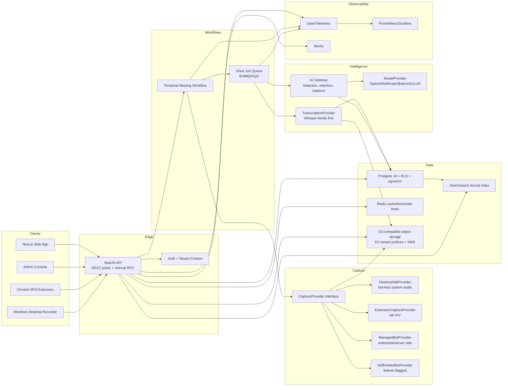

# Meet-X Architecture

## Mission

Meet-X is a multi-tenant meeting intelligence platform that captures meetings with consent, stores recordings securely, transcribes multilingual speech, produces cited summaries, and makes meetings searchable and shareable under strict permissions.

## System diagram

## Component responsibilities

### API

The API owns authentication, tenant context, health checks, public REST endpoints, and internal service calls. It must set tenant context for every database transaction before accessing tenant-scoped tables.

### Capture SDK

Application services depend only on capture interfaces. Concrete providers are selected by tenant policy, meeting source, device availability, and feature flags.

- `DesktopSdkProvider`: implemented Windows companion for consent-gated system-audio loopback plus microphone capture, with optional explicit entire-screen or application-window video.
- `ExtensionCaptureProvider`: future Chrome MV3 tab recorder for browser meetings.
- `ManagedBotProvider`: optional enterprise/server-side capture provider when customers authorize a meeting bot.
- `SelfHostedBotProvider`: feature-flagged browser automation fallback with explicit ToS risk tracking.

### Temporal workflow

Meeting lifecycle orchestration belongs in Temporal because joins, waiting rooms, recording, upload, processing, and retries are long-running and must survive deploys.

### Database

Postgres is the source of truth. Tenant-scoped tables carry `organization_id` and use RLS. `pgvector` supports semantic retrieval after permission filters are applied.

### Object storage

Media is never stored in the database. Recordings, thumbnails, waveforms, and intermediate artifacts live in S3-compatible storage under tenant and region-scoped prefixes with KMS encryption and lifecycle policies.

### AI gateway

All customer-content AI calls go through one gateway that handles redaction, prompt versioning, schema validation, citations, tenant model policy, retention flags, token accounting, and provider fallback.

## Data flow: calendar event to shareable summary

1. Calendar sync reads an event and detects a conference link.
2. Auto-join policy evaluates meeting ownership, internal/external status, calendar override, and consent requirements.
3. Temporal starts a meeting workflow.
4. Capture provider is selected. For launch, bot-less device or Chrome extension capture is preferred when available; managed capture is allowed only under tenant policy.
5. Recorder presence and disclosure are shown or posted according to workspace policy.
6. Audio/video artifacts upload resumably to S3-compatible storage with checksums.
7. ASR consumes audio, produces word timestamps and speaker-attributed segments, and writes transcript rows.
8. AI gateway summarizes transcript chunks, validates structured output, and requires citations for every claim.
9. Search indexer indexes permitted transcript segments and metadata.
10. Sharing service creates a scoped link with expiry/password/org-only controls.
11. User opens the summary; each action item, decision, and key point links back to timestamped evidence.

## Launch-specific capture posture

Because Meet-X requires bot-less system sound and Chrome extension capture at launch, the capture abstraction must treat personal-device capture as first-class rather than as a fallback. Managed capture remains useful for enterprise customers that want server-side recording, but it is no longer the only Phase 1 default.

## Multilingual ASR starting point

For the best free multilingual baseline, start with OpenAI Whisper large-v3 or large-v3-turbo weights through faster-whisper/CTranslate2 for local inference. The Phase 2 acceptance gate must benchmark language detection, word timestamps, diarisation pipeline quality, cost per meeting-hour, and WER on the product fixture corpus before locking the production default.

## Unified recorder transcription timing modes

The Windows and browser recorders offer the same two explicit choices. Live mode records independent 10-second WebM audio clips, processes them sequentially with local Whisper, persists session state, rebases timestamps to the meeting timeline, and displays the rolling transcript in the recorder and shared Live meeting page. Post mode runs one full-file pass after upload.

Both modes retain the complete recording, automatically save completed sessions to the Meeting Library, and fall back to full-file post processing when live finalization fails. The browser uses its native tab/window/screen picker; the Windows agent uses an equivalent in-app entire-screen/application-window selector because Electron installs a custom display-media handler for loopback audio.
